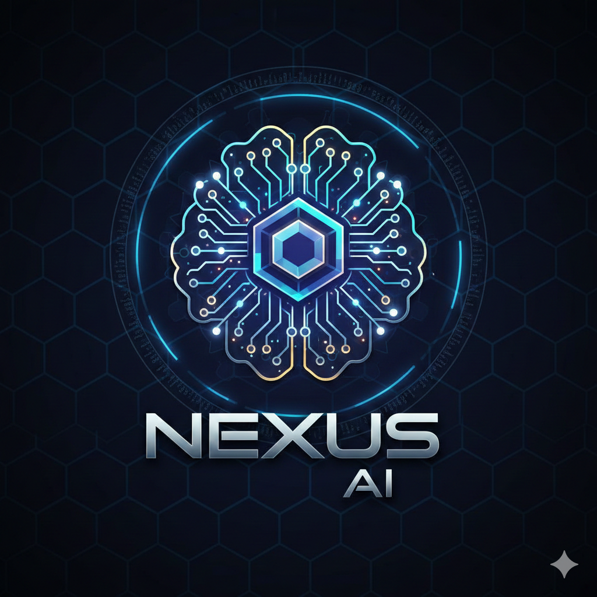

# 📱 Nexus AI - Mobile Progressive Web App

<div align="center">



**Your Intelligent AI Assistant - Now Available as a Mobile App!**

[](.)
[](.)
[](.)

</div>

---

## 🚀 What's New - Mobile App Version

Your Nexus AI chat application is now a **Progressive Web App (PWA)** that can be installed on any device!

### ✨ New Features

- 📱 **Install to Home Screen** - Works like a native mobile app
- 📴 **Offline Support** - Access your chat history without internet
- ⚡ **Lightning Fast** - Service worker caches for instant loading
- 🎨 **Mobile Optimized** - Responsive design for all screen sizes
- 🔔 **Install Prompt** - Smart banner prompts users to install
- 📊 **Offline Indicator** - Know when you're offline
- 🍎 **iOS Compatible** - Full iPhone/iPad support
- 🤖 **Android Ready** - Install from Chrome/Edge

---

## 📦 What's Included

### Core Files
- ✅ `index.html` - Main app interface (updated with PWA support)
- ✅ `script.js` - Chat logic with Gemini/OpenAI integration
- ✅ `style.css` - Enhanced mobile-first CSS
- ✅ `database.js` - Dexie.js database for chat history

### PWA Files (NEW!)
- ✅ `manifest.json` - App configuration & metadata
- ✅ `service-worker.js` - Offline caching & background sync
- ✅ `PWA_INSTALL_GUIDE.md` - Complete installation instructions

---

## 🎯 Quick Start

### 1️⃣ Test Locally

Start a local server:

```bash
# Navigate to the project folder
cd d:\Programing\HTML\Nexus

# Option 1: Python (recommended)
python -m http.server 8000

# Option 2: Node.js
npx http-server -p 8000
```

Then open: **http://localhost:8000**

### 2️⃣ Install on Mobile

#### **Android:**
1. Open Chrome browser
2. Visit your app URL
3. Tap **"Install"** when the banner appears
4. App added to home screen! 🎉

#### **iPhone/iPad:**
1. Open Safari browser
2. Visit your app URL
3. Tap Share → **"Add to Home Screen"**
4. App added to home screen! 🎉

---

## 🌐 Deploy for Public Access

Deploy your app so others can install it:

### **GitHub Pages (Free & Easy)**
```bash
# Create a new repo on GitHub
# Upload all files
# Enable GitHub Pages in Settings
# Your app: https://username.github.io/nexus-ai/
```

### **Netlify (Recommended)**
1. Drag & drop the `Nexus` folder to [netlify.com](https://netlify.com)
2. Get instant HTTPS URL
3. Share with anyone!

### **Vercel**
1. Import project at [vercel.com](https://vercel.com)
2. Deploy with one click
3. Done!

> **Important:** PWAs require **HTTPS** to work (except on localhost)

---

## 🛠️ Technical Architecture

### PWA Features Implemented

```
┌─────────────────────────────────────┐
│         Nexus AI PWA Stack          │
├─────────────────────────────────────┤
│  📱 Manifest.json                   │
│    ↳ App metadata & icons           │
├─────────────────────────────────────┤
│  ⚙️  Service Worker                 │
│    ↳ Offline caching                │
│    ↳ App shell pattern              │
│    ↳ Network-first strategy         │
├─────────────────────────────────────┤
│  🎨 Mobile-First CSS                │
│    ↳ Safe area support              │
│    ↳ Touch optimization             │
│    ↳ Responsive breakpoints         │
├─────────────────────────────────────┤
│  💾 IndexedDB (Dexie.js)            │
│    ↳ Chat history                   │
│    ↳ Settings & API keys            │
├─────────────────────────────────────┤
│  🤖 AI Integration                  │
│    ↳ Google Gemini API              │
│    ↳ OpenAI API                     │
│    ↳ Auto-fallback models           │
└─────────────────────────────────────┘
```

### Caching Strategy

**App Shell (Immediate Cache):**
- HTML, CSS, JavaScript files
- Logo & icons
- Core fonts

**Runtime Cache (On Demand):**
- External CDN resources
- Dynamic content
- User data stays in IndexedDB

**Network First:**
- API calls (Gemini/OpenAI)
- Always fetch fresh AI responses

---

## 📱 Mobile Optimization Features

### Touch & Gestures
- ✅ 44px minimum touch targets
- ✅ No tap highlight flicker
- ✅ Touch manipulation optimization
- ✅ Disabled text selection on UI elements

### Screen Support
- ✅ Safe area insets (notched screens)
- ✅ Portrait & landscape modes
- ✅ iOS status bar styling
- ✅ Responsive sidebar (hidden on mobile)

### Performance
- ✅ CSS animations with `cubic-bezier`
- ✅ Lazy loading strategies
- ✅ Minimal reflows & repaints
- ✅ Optimized font loading

---

## 🔧 Configuration

### Customize App Details

Edit `manifest.json`:
```json
{
  "name": "Your App Name",
  "short_name": "App",
  "theme_color": "#0ea5e9",
  "background_color": "#0f172a"
}
```

### Update Service Worker Cache

Edit `service-worker.js`:
```javascript
const CACHE_NAME = 'nexus-ai-v1.0.0'; // Update version
```

### Customize Icons

Replace `logo.png` with your icon:
- Recommended: 512×512 PNG
- Transparent or solid background
- Simple, recognizable design

---

## 📊 Browser Support

| Browser | Install | Offline | Notifications |
|---------|---------|---------|---------------|
| Chrome (Android) | ✅ | ✅ | ✅ |
| Edge (Android) | ✅ | ✅ | ✅ |
| Safari (iOS) | ✅ | ✅ | ⚠️ Limited |
| Firefox (Android) | ⚠️ Manual | ✅ | ✅ |
| Chrome (Desktop) | ✅ | ✅ | ✅ |
| Edge (Desktop) | ✅ | ✅ | ✅ |

---

## 🧪 Testing Checklist

Before deploying, test these features:

- [ ] Install prompt appears on first visit
- [ ] App installs to home screen successfully
- [ ] Service worker registers (check DevTools)
- [ ] Offline mode works (disable network)
- [ ] Chat history persists across sessions
- [ ] API keys save securely
- [ ] Responsive design on mobile
- [ ] Icons display correctly
- [ ] Theme color applies to UI

---

## 🐛 Troubleshooting

### Install Banner Not Showing?
- Ensure HTTPS connection (or localhost)
- Check if app already installed
- Clear browser cache
- Try different browser

### Service Worker Errors?
- Check browser console for details
- Verify file path: `/service-worker.js`
- Hard refresh (Ctrl+Shift+R)
- Unregister old worker in DevTools

### Offline Mode Not Working?
- Visit app while online first
- Check Cache Storage in DevTools
- Verify service worker is active
- Check network requests

### iOS Installation Issues?
- Must use **Safari** browser
- Older iOS versions may not support
- Check if already installed

---

## 📚 Resources

- **Installation Guide:** [PWA_INSTALL_GUIDE.md](PWA_INSTALL_GUIDE.md)
- **Google Gemini API:** [Google AI Studio](https://makersuite.google.com/app/apikey)
- **OpenAI API:** [OpenAI Platform](https://platform.openai.com/api-keys)
- **PWA Documentation:** [web.dev/progressive-web-apps](https://web.dev/progressive-web-apps/)

---

## 🎨 Screenshots

### Desktop View
- Modern chat interface with sidebar
- Settings modal with API configuration
- Multi-provider support (Gemini/OpenAI)

### Mobile View
- Full-screen chat experience
- Touch-optimized controls
- Offline indicator
- Install banner

---

## 🚀 Future Enhancements

Potential features to add:

- [ ] Push notifications for messages
- [ ] Background sync for offline messages
- [ ] Voice input (Web Speech API)
- [ ] Text-to-speech responses
- [ ] Image generation support
- [ ] Code syntax highlighting
- [ ] Export chat as PDF/Markdown
- [ ] Multiple chat themes
- [ ] Conversation search
- [ ] Cloud sync (Firebase/Supabase)

---

## 🤝 Contributing

Have ideas for improvements? Feel free to:
1. Fork the repository
2. Make your changes
3. Test thoroughly
4. Submit a pull request

---

## 📄 License

This project is open source and available for personal and commercial use.

---

## 🎉 Credits

**Built with:**
- [Tailwind CSS](https://tailwindcss.com) - Styling framework
- [Dexie.js](https://dexie.org) - IndexedDB wrapper
- [Lucide Icons](https://lucide.dev) - Icon library
- [Google Gemini](https://ai.google.dev) - AI model
- [OpenAI](https://openai.com) - AI model

---

<div align="center">

**Made with ❤️ for mobile-first AI experiences**

[Report Bug](.) • [Request Feature](.) • [View Demo](.)

</div>
